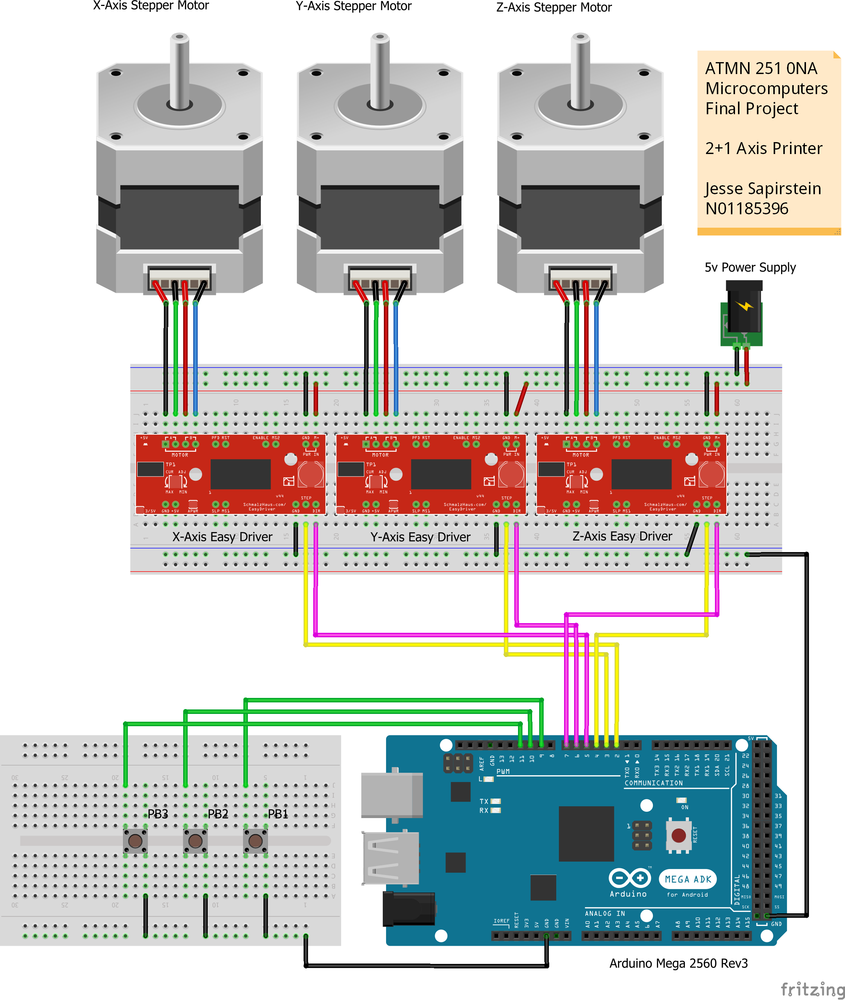
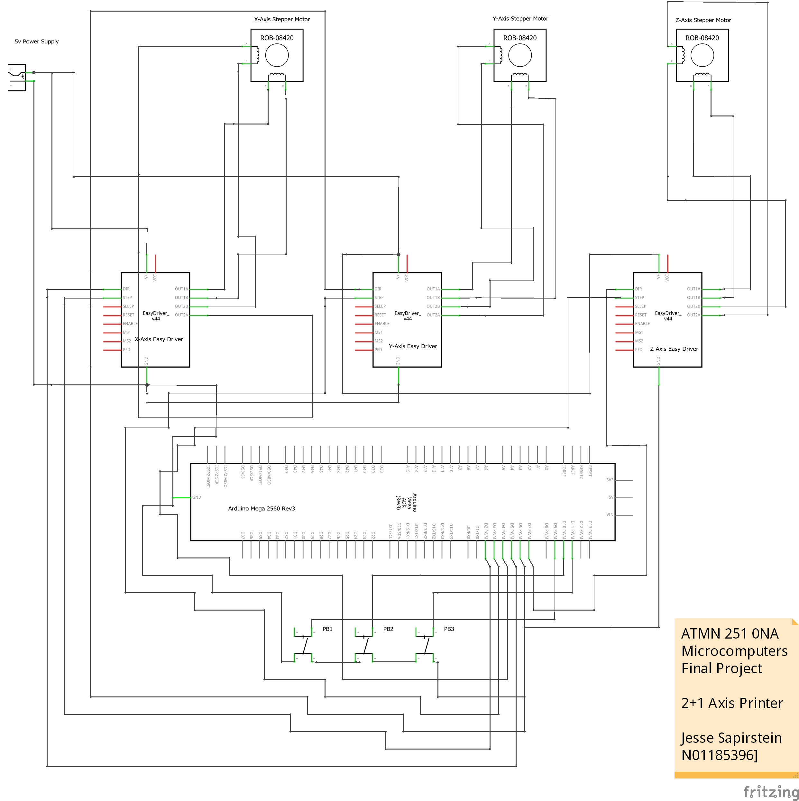

# 3-Axis Printer Project

## Microcomputer Based Automation ATMN 251 -- Winter 2018

  
   
  
   

## OVERVIEW

Simple 3-axis printer, using 3 scavenged CD-ROM drive stepper motors. Printer takes one-line input strings and converts them to printed text (print mode). Alternatively, the user can manipulate the individual stepper motor axes to draw an image (freedraw mode). 
	
Motors are arranged in a 2+1 configuration where the X-axis and Y-axis stepper motors operate in tandem to control the position of the printer bed in the plane
parallel to the earth. The Z stepper operates independently to minutely adjust the vertical position of the printer tip to bring or break contact with the printer tip as
needed.

Not a true "3D" printer in a space-filling sense, since this was a relatively short demo project and the Z axis was intended for use with a stylus rather than filament. Code could be fairly easily adapted though. 

## MATERIALS

- Arduino 2560 Mega Microcontroller Rev3

- CD-ROM drives (**x3**)

- Easy Driver stepper motor drivers (**x3**)

- Mounting frame

- USB 2.0 type A-to-B cable

- Generic NO momentary push-buttons (**x3**)

## I/O

| Input                                         | Label | Pin |
|-----------------------------------------------|-------|-----|
| Momentary push-button 1		        | PB1   | 9   |
| Momentary push-button 2 		        | PB2   | 10  |
| Momentary push- button 3                       | PB3   | 11  |

 

| Output                                        | Label | Pin |
|-----------------------------------------------|-------|-----|
| Stepper pin for **X-axis** EasyDriver board   | xStep | 2   |
| Stepper pin for **Y-axis** EasyDriver board   | yStep | 3   |
| Stepper pin for **Z-axis** EasyDriver board   | zStep | 4   |
| Direction pin for **X-axis** EasyDriver board | xDir  | 5   |
| Direction pin for **Y-axis** EasyDriver board | yDir  | 6   |
| Direction pin for **Z-axis** EasyDriver board | zDir  | 7   |
| On-board Arduino LED indicator                | LED   | 13  |

## LAYOUT

 
 
## WIRING

 
 

